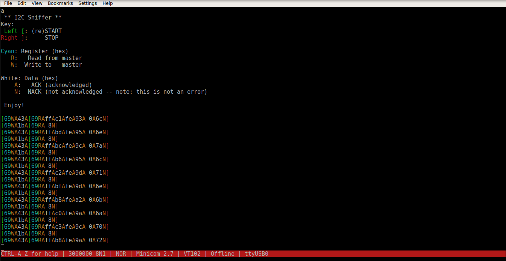
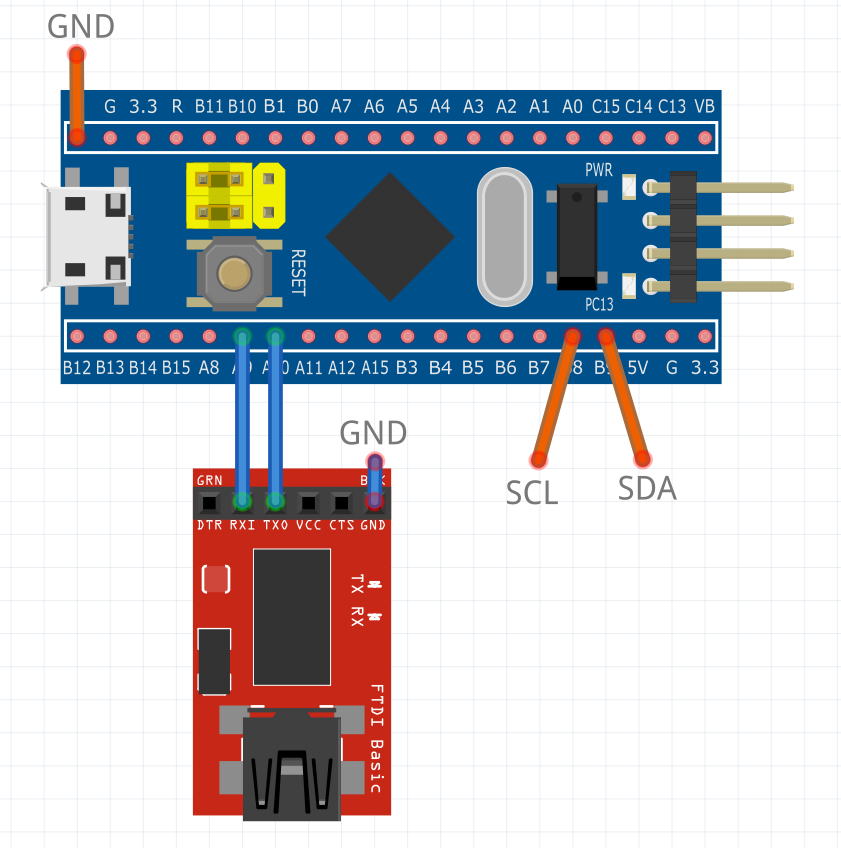

# I2C sniffer project
- **Board:** STM32F103C8T6 "Blue Pill"
- **Pins used:**
  - **PA9**: TX (connect to serial RX)
  - **PA10**: RX (connect to serial TX)
  - **PB8**: SCL
  - **PB9**: SDA
- **Serial baud rate**: 3 000 000 bits/s
- **Additional required hardware**: [FTDI232](https://www.sparkfun.com/products/12731) (or similar) USB-to-Serial converter
  
## Project Purpose
This project is built to connect to any I2C network and process any data sent through it in a transparent way.
It's useful for debugging faulty networks.
  
## Notes
- This project was built in STM32CubeMX for the Atollic TrueStudio IDE. If you load the project in STM32CubeMX, you can export
it to use any other IDE of your choice.
- This project sets the processor clock to 72 MHz, the highest one achievable, so that the I2C data can be processed
as fast as possible.
- The serial output contains colours. If your terminal doesn't support colours, you might see garbled characters.
- UART is used to output the data. You can connect an FTDI232 USB-to-Serial converter to receive the information.
  Note that you have to use a converter that supports a baud rate of 3 Mbits/sec.

  The command I used to open the terminal on linux was:
  ```bash
  minicom -s -c on -b 3000000 -D /dev/ttyUSB0
  ```
  
  You can also use [RealTerm](https://sourceforge.net/projects/realterm/) on Windows.
- The HAL driver is used, but all the necessary driver files are included in the *Drivers* folder.

## Important files
- **Src/main.c**: The source code of the project
- **i2c_sniffer.ioc**: Open this file inside STM32CubeMX to edit the project.

## Screenshot
[](https://github.com/kongr45gpen/i2c-sniffer/raw/master/screenshot.png)
  
## Schematic
[](https://github.com/kongr45gpen/i2c-sniffer/raw/master/schematic.png)
